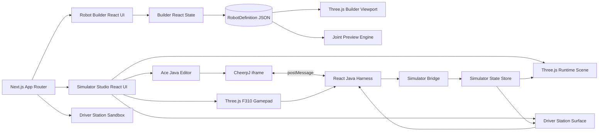
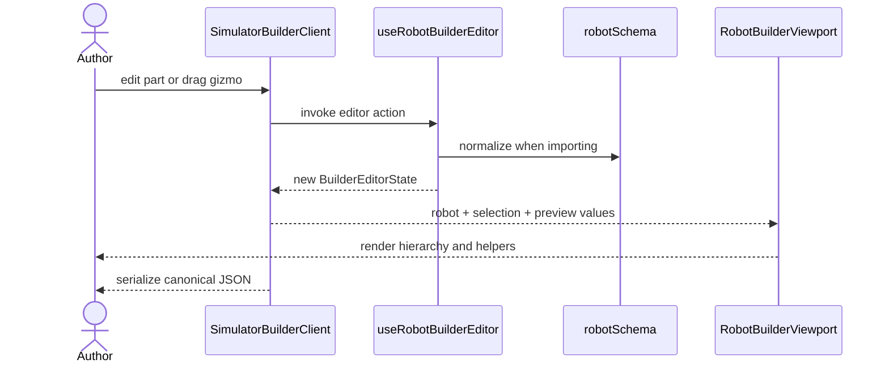
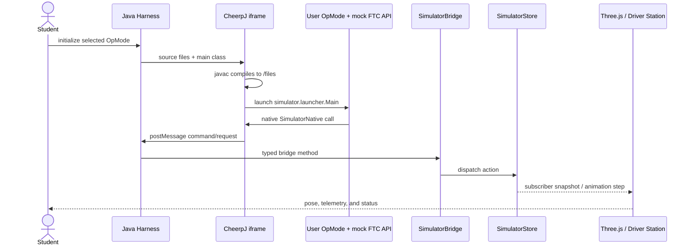

# System architecture

## Architectural summary

The project is a Next.js App Router application whose interactive workspaces are client-side React
components. Three.js owns the 3D scenes. The builder uses React state and a versioned JSON model;
the simulator uses an external-store-style TypeScript state machine. User Java runs in an isolated
iframe under CheerpJ and communicates with React through `window.postMessage`.



## Layer map

| Layer | Primary files | Responsibility |
|---|---|---|
| Routing and shell | `app/layout.tsx`, `app/**/page.tsx` | Metadata, navigation, and route entry points |
| Builder UI | `components/simulator-builder/SimulatorBuilderClient.tsx` | Builder panels, editing workflow, import/export |
| Builder scene | `components/simulator-builder/RobotBuilderViewport.tsx` | Three.js hierarchy, selection, transforms, preview rendering |
| Builder domain | `lib/simulator/builder/robotSchema.ts`, `editorStore.ts`, `previewMovement.ts` | Schema, normalization, actions, joint preview rules |
| Proposed lesson library | `lib/simulator/builder/types.ts`, `defaultLibrary.ts` | Scaffolded component/lesson types; not connected to the current builder |
| Simulator composition | `components/simulator/SimulatorTestClient.tsx` | Three-pane layout, runtime scene, bridge exposure, state wiring |
| Java execution | `components/simulator/SimulatorJavaHarness.tsx` | Editor, mock FTC Java sources, compilation, lifecycle, messaging |
| Simulation domain | `lib/simulator/mechanismSimulator.ts` | State, reducer, time step, devices, telemetry, bridge API |
| Driver controls | `DriverStationSurface.tsx`, `SimulatorStudioDriverStation.tsx` | Reusable driver-station UI and runtime adapter |
| Gamepad | `F310Gamepad.tsx`, `public/Models/GamepadAssembly.glb` | Interactive 3D controller and input state |
| UI primitives | `components/ui/*`, `lib/utils.ts` | Local Button/Card/Input/Textarea styling helpers |

## Application routes

```mermaid
flowchart TD
    Root[/] --> Builder[/simulator-builder]
    Root --> Simulator[/simulator-test]
    Root --> DSTest[/driver-station-test]
    Builder --> BuilderClient[SimulatorBuilderClient]
    Simulator --> SimulatorClient[SimulatorTestClient]
    DSTest --> DSTestClient[DriverStationTestClient]
```

All route files are server components by default, but each interactive surface delegates to a
`"use client"` component. There are currently no API routes or server actions.

## Builder data flow



The builder has no persistence layer. Refreshing the page resets it to the starter chassis unless
the user copies the exported JSON elsewhere and imports it later.

## Java runtime data flow



The iframe loads CheerpJ 4.2 from a remote CDN and looks for `tools.jar` at `/app/tools.jar`, then
`/tools.jar`. The repository currently contains both public paths. Details are in
[[05 - Java Harness and FTC API]].

## Runtime ownership

`SimulatorTestClient` is the composition root for the integrated runtime:

- it creates one `SimulatorStore` and one `SimulatorBridge` per mounted page;
- it runs `store.step(deltaSeconds)` inside the Three.js animation frame;
- it subscribes React to store updates for telemetry and controls;
- it owns the gamepad state passed to the Java harness;
- it receives a driver-station view model from the harness;
- it publishes `window.codeARobotSimulator` plus simulator-ready/state-changed DOM events.

This ownership keeps the domain state independent of React, but rendering, time stepping, and UI
composition still live together in one large client component.

## Deployment and external dependencies

The build is a conventional Next.js application. At runtime, two external/static resources matter:

- CheerpJ loader: `https://cjrtnc.leaningtech.com/4.2/loader.js` (network required);
- Java 8 compiler runtime: the checked-in `public/tools.jar` or `public/app/tools.jar`.

The gamepad uses the checked-in `public/Models/GamepadAssembly.glb`. The robot builder and runtime
otherwise construct geometry in code.

## Main architectural seam to close

The project has two robot models today:

1. Builder: arbitrary `RobotDefinition` part trees and joints.
2. Runtime: a fixed drivetrain/arm/claw state and a hard-coded Three.js robot.

The highest-leverage future change is a translation/runtime layer that loads `RobotDefinition`,
binds named hardware devices to joints or drivetrain roles, and generates both the runtime scene
and simulator devices from the same configuration. See [[08 - Roadmap]].
