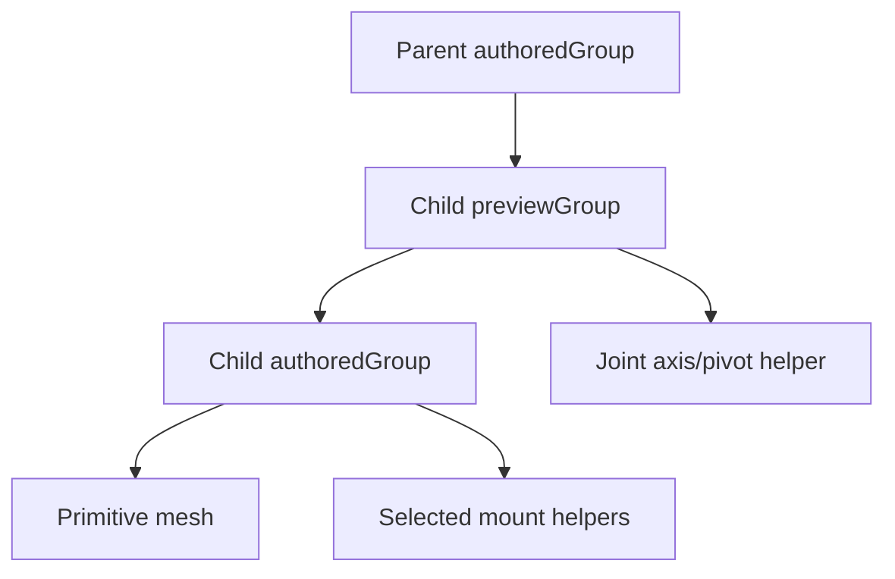

# Robot builder

The robot builder at `/simulator-builder` is a client-side editor for creating a hierarchical robot
from simple 3D primitives. Its canonical output is `RobotDefinition` JSON.

## Current workflow

1. Name the robot.
2. Add box, cylinder, sphere, or capsule parts.
3. Select a part in the viewport or hierarchy.
4. Edit its ID, name, type, color, visibility, parent, and local transform.
5. Add mount points to describe reusable attachment locations.
6. Configure a fixed, revolute, or prismatic joint.
7. Pose a joint manually or run the non-destructive movement preview.
8. Copy the serialized JSON or paste JSON back into the importer.

The initial robot is schema version 2 and contains a single blue `Starter Chassis` box with a
`Top Center` mount point.

## State and actions

`useRobotBuilderEditor` owns a single `BuilderEditorState`:

```text
robot                canonical RobotDefinition
selectedPartId       current selection
transformMode        translate | rotate | scale
jointPreviewValues   temporary pose by part ID
```

Its actions cover robot naming/replacement, selection, adding/removing/updating parts, changing
IDs, reparenting, attaching to mount points, mount-point CRUD, joint updates, and preview reset.

Important invariants maintained by the store and importer:

- `rootPartIds` is derived from parts without valid parents.
- Part IDs must be non-empty and unique.
- Renaming a part updates its children's `parentId` references.
- A part cannot be parented to itself or one of its descendants.
- Removing a parent promotes its direct children to roots.
- Joint axes are normalized and joint preview values are clamped to their limits.

## Scene graph

Each `RobotPart` becomes two nested Three.js groups:



- `previewGroup` applies temporary revolute or prismatic movement.
- `authoredGroup` applies the saved local position, rotation, and scale.
- Child `previewGroup` objects attach beneath the parent `authoredGroup`.

This separation lets movement previews remain non-destructive: animated joint values alter the
preview group without rewriting the authored `RobotDefinition` transform.

## Viewport interaction

The viewport provides orbit controls, raycast selection, and local transform controls. Transform
gizmos snap translation to `0.1`, rotation to 5 degrees, and scale to `0.05`. Gizmos are detached
while automatic movement preview is active.

Selection displays:

- a white edge outline;
- cyan mount-point spheres with axis helpers;
- a revolute/prismatic axis line;
- an orange pivot marker for revolute joints.

## Joints

| Joint type | Stored properties | Preview behavior |
|---|---|---|
| `fixed` | type only | No relative motion |
| `revolute` | pivot, normalized axis, limits, initial value | Rotates in degrees around the local pivot |
| `prismatic` | normalized axis, limits, initial value | Translates in local scene units |

Manual preview values live outside the robot definition. The automatic preview animates between
limits, with special behavior inferred from part ID/name/kind and mount tags:

- wheel-like revolute parts spin continuously;
- servo-like parts sweep at a servo-specific rate;
- motor-like revolute parts sweep at a motor rate;
- prismatic parts move back and forth at a fixed linear rate;
- the words `reverse`, `reversed`, or `inverted` reverse wheel spin.

This name/tag inference is a prototype convenience, not a durable hardware-binding contract.

## Preview validation

When movement preview is enabled, warnings detect a few common rig problems:

- zero-length movable-joint axis;
- wheel-like part without a revolute joint;
- servo-like movable part without explicit limits;
- motor/servo/wheel-like part configured as fixed;
- revolute pivot unusually far from the part's local bounds.

Warnings are advisory and do not block export.

## Import and export

Import parses pasted JSON and runs `normalizeRobotDefinition`. Invalid top-level shape, missing part
IDs, duplicate IDs, and unsupported primitive kinds produce user-visible errors. Recoverable data
is normalized; see [[06 - RobotDefinition Schema]].

Export is a read-only text area containing pretty-printed JSON. There is currently no file picker,
download button, autosave, browser storage, or server persistence.

## Scaffolded component library

`lib/simulator/builder/defaultLibrary.ts` defines chassis, motor, wheel, arm, servo, claw, and sensor
component metadata using the older `BuilderComponentDefinition`/`TeacherLessonDraft` types. Nothing
imports this library today, so it is scaffolded rather than an active builder feature. The active
builder uses primitives and `RobotDefinition` exclusively.

## Extension points

The schema comments reserve room for imported mesh assets, hardware bindings, sensors, runtime
mappings, drivetrain metadata, a control hub, an asset manifest, and lesson metadata. These should
be introduced through versioned migrations rather than as UI-only state.

## Related notes

- [[02 - System Architecture]]
- [[06 - RobotDefinition Schema]]
- [[08 - Roadmap]]
