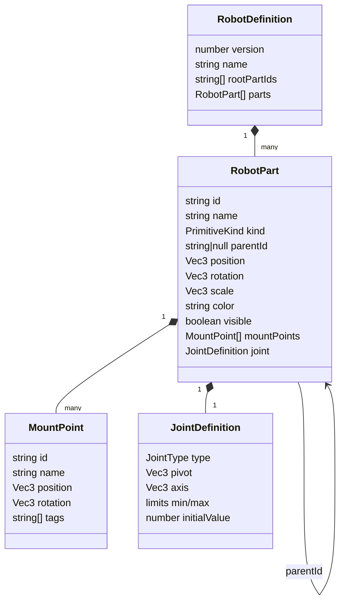

# `RobotDefinition` schema

> [!info] Replacement contract in progress
> This note describes the schema used by the current builder. The catalog-backed v3 contracts are
> now implemented under `lib/robot/schema` but are not wired into either UI yet. Their design and
> cutover plan are documented in [[10 - FTC Builder Rebuild Plan]].

`RobotDefinition` is the active builder's canonical, JSON-serializable robot contract. The current
schema version is 2. Its TypeScript definition and normalization functions live in
`lib/simulator/builder/robotSchema.ts`.

## Object model



## Field reference

### `RobotDefinition`

| Field | Type | Meaning |
|---|---|---|
| `version` | number | Schema version; importer raises values below 2 to 2 |
| `name` | string | Human-readable robot name |
| `rootPartIds` | string[] | Derived IDs of parts without a parent |
| `parts` | `RobotPart[]` | Flat list whose `parentId` fields form the hierarchy |

### `RobotPart`

| Field | Type | Meaning |
|---|---|---|
| `id` | string | Unique stable identifier within the robot |
| `name` | string | Human-readable label |
| `kind` | `box \| cylinder \| sphere \| capsule` | Generated Three.js primitive |
| `parentId` | string or `null` | Parent part; `null` denotes a root |
| `position` | `[x, y, z]` | Local position relative to its parent |
| `rotation` | `[x, y, z]` | Local Euler rotation in degrees |
| `scale` | `[x, y, z]` | Local primitive dimensions/scale factors |
| `color` | string | CSS/Three.js-compatible color string |
| `visible` | boolean | Whether the part and its descendants render |
| `mountPoints` | `MountPoint[]` | Named child attachment references |
| `joint` | `JointDefinition` | Motion relative to the parent |

### `MountPoint`

A mount point has a part-local ID, display name, local position and degree rotation, and optional
string tags. Attaching a child copies the mount's position and rotation into the child and assigns
the parent. The child does not retain the mount-point ID, so later mount edits do not move already
attached children.

### `JointDefinition`

```ts
{ type: "fixed" }

{
  type: "revolute";
  pivot: [number, number, number];
  axis: [number, number, number];
  limits: { min: number; max: number }; // degrees
  initialValue: number;
}

{
  type: "prismatic";
  axis: [number, number, number];
  limits: { min: number; max: number }; // scene units
  initialValue: number;
}
```

Axes are normalized. Revolute defaults are axis `[0, 0, 1]` and limits `-90..90`; prismatic
defaults are axis `[1, 0, 0]` and limits `0..1`.

## Example

```json
{
  "version": 2,
  "name": "Arm Demo",
  "rootPartIds": ["chassis"],
  "parts": [
    {
      "id": "chassis",
      "name": "Chassis",
      "kind": "box",
      "parentId": null,
      "position": [0, 0.35, 0],
      "rotation": [0, 0, 0],
      "scale": [2.6, 0.35, 1.8],
      "color": "#2563eb",
      "visible": true,
      "mountPoints": [
        {
          "id": "arm-mount",
          "name": "Arm Mount",
          "position": [0, 0.5, 0],
          "rotation": [0, 0, 0],
          "tags": ["mechanism"]
        }
      ],
      "joint": { "type": "fixed" }
    },
    {
      "id": "arm",
      "name": "Arm Motor",
      "kind": "box",
      "parentId": "chassis",
      "position": [0, 0.5, 0],
      "rotation": [0, 0, 0],
      "scale": [0.3, 2, 0.3],
      "color": "#f59e0b",
      "visible": true,
      "mountPoints": [],
      "joint": {
        "type": "revolute",
        "pivot": [0, -1, 0],
        "axis": [0, 0, 1],
        "limits": { "min": -15, "max": 85 },
        "initialValue": 12
      }
    }
  ]
}
```

## Import normalization

The importer rejects non-object roots, missing `parts` arrays, non-object parts, missing/non-string
part IDs, duplicate IDs, and unsupported primitive kinds. It repairs or defaults other fields:

- missing names become the part ID or `Imported Robot`;
- invalid vectors receive field-specific defaults;
- missing colors, visibility, mount points, and joints receive defaults;
- duplicate/missing mount IDs receive generated positional IDs;
- invalid parents become `null`;
- detected parent cycles are broken by promoting affected parts to roots;
- limits are sorted and initial values clamped;
- zero-length joint axes fall back to the joint's default axis;
- `rootPartIds` from imported JSON is ignored and derived from normalized parents.

> [!important] Versioning caveat
> Import currently normalizes directly into version 2; there is no explicit migration registry or
> version-specific parser. Add migrations before making incompatible schema changes.

## Coordinate conventions

- Three.js uses a Y-up scene.
- Part positions, rotations, scales, mount points, pivots, and axes are local to the parent part.
- Rotation and revolute values are authored in degrees and converted to radians for rendering.
- Scale is applied to unit primitive geometry and therefore acts as the part's dimensions.
- No unit is formally declared for linear dimensions; runtime meters and builder scene units are not
  yet connected.

## Planned extension areas

The implementation explicitly anticipates part-level hardware bindings, sensors, imported mesh
references, runtime mappings, and robot-level drivetrain, control-hub, asset-manifest, and lesson
metadata. See [[08 - Roadmap]] for a proposed order.

## Related notes

- [[03 - Robot Builder]]
- [[02 - System Architecture]]
