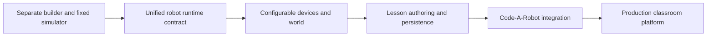

# Roadmap

This roadmap translates the current prototype, code comments, and stated goal of extending
codearobot.org into a proposed development sequence. It is a planning aid, not a committed release
schedule.

## North star

A teacher can create or select a lesson robot, bind its mechanisms and sensors to FTC hardware
names, attach starter code and objectives, publish the lesson through Code-A-Robot, and let students
write and run code against the same robot definition in a safe browser simulator.

## Phase 1 — Stabilize the prototype

Goal: make today's behavior explicit, testable, and maintainable.

- Add unit tests for schema normalization, cycle breaking, builder actions, joint preview, reducer
  actions, and time-step behavior.
- Add integration tests for iframe message validation and bridge/device semantics.
- Add browser tests for builder import/export and the Java INIT/START/STOP lifecycle.
- Add lint/format/test scripts and CI checks.
- Break the largest client components into hooks, runtime adapters, renderers, and focused panels.
- Define deployment requirements for CheerpJ, `tools.jar`, WebAssembly, CSP, and browser support.
- Decide whether both checked-in `tools.jar` paths are needed and document their provenance/license.

Exit criterion: current routes behave consistently and critical domain rules have automated tests.

## Phase 2 — Unify builder and runtime

Goal: make one robot definition drive authoring and simulation.

The detailed implementation plan for this phase is [[10 - FTC Builder Rebuild Plan]]. That note
supersedes the brief checklist below where the two differ.

- Extend `RobotDefinition` with explicit hardware bindings rather than name/tag inference.
- Add robot-level drivetrain configuration, dimensions/units, control hubs, and device inventory.
- Define versioned schema migrations and compatibility policy.
- Build a loader that converts the part tree into a runtime scene graph.
- Bind motors/servos to specific joints and map drivetrain roles to configured wheels.
- Generalize per-motor targets, encoder conversion, limits, and direction.
- Load a builder export directly into `/simulator-test` and remove the hard-coded runtime robot.
- Reconcile or retire the older `TeacherLessonDraft`/component-library scaffold.

Exit criterion: changing the selected robot configuration changes both the rendered robot and the
hardware available to student Java.

## Phase 3 — Expand simulation and FTC teaching coverage

Goal: support useful FTC programming lessons beyond the fixed mechanism demo.

- Add sensor models, starting with distance, touch, color, and IMU/heading.
- Expand FTC mocks with motor direction, zero-power behavior, velocity, additional run modes,
  richer telemetry, and clear unsupported-API diagnostics.
- Support two independently controlled gamepads and optional physical Gamepad API input.
- Add field definitions, starting poses, obstacles/game elements, collisions, and configurable
  simulation fidelity.
- Define deterministic stepping or recording so lessons and tests can be replayed.
- Surface configuration errors when Java requests missing or incompatible hardware.
- Add debugging tools: pause, single-step, reset, state inspection, and clearer compile/runtime
  errors.

Exit criterion: representative autonomous and TeleOp lessons can teach drivetrain, mechanisms,
sensors, and feedback control with predictable behavior.

## Phase 4 — Lesson authoring and persistence

Goal: turn the technical simulator into a curriculum workflow.

- Define a versioned lesson schema containing objectives, instructions, starter files, robot, field,
  expected outcomes, visibility options, and assessment metadata.
- Provide component and robot libraries with reusable assets and validated attachment points.
- Add file-based import/export before server persistence so content remains portable.
- Add autosave, drafts, version history, and asset management.
- Create teacher preview and student run modes with appropriate editing permissions.
- Add testable lesson success criteria and teacher-visible results.
- Add accessibility, keyboard-only controls, responsive layouts, and lower-spec rendering modes.

Exit criterion: a teacher can author, save, reopen, preview, and share a complete simulator lesson.

## Phase 5 — Code-A-Robot integration

Goal: make the simulator a maintained extension of the main product.

- Choose the integration boundary: embedded route/package, shared service, or separately deployed
  application with an authenticated protocol.
- Reuse Code-A-Robot identity, roles, course/lesson data, design system, analytics, and deployment
  conventions where appropriate.
- Define stable launch, load, save, and result events/APIs.
- Establish permissions for teachers, students, curriculum authors, and administrators.
- Migrate standalone lesson/robot data without breaking schema versions.
- Add observability for compiler loading, runtime failures, performance, and browser compatibility.

Exit criterion: Code-A-Robot can launch an assigned simulator lesson, persist student work, and
record completion through a supported integration contract.

## Phase 6 — Production safety and scale

Goal: support classroom use reliably.

- Threat-model untrusted Java, cross-window messaging, assets, and imported JSON.
- Enforce execution time, memory, loop, and message-rate limits with reliable termination.
- Tighten iframe sandbox/origin handling and deploy a restrictive, tested CSP.
- Add privacy/data-retention rules and age-appropriate telemetry practices.
- Cache/version runtime dependencies and provide graceful offline/degraded behavior where feasible.
- Test on target school devices and networks; define performance budgets.
- Publish an incident, rollback, and schema-deprecation process.

Exit criterion: the platform meets agreed security, privacy, reliability, and performance standards.

## Near-term priority order

If only a few investments can happen next, prioritize:

1. Versioned tests around current schema and simulator state.
2. Explicit hardware-binding design for `RobotDefinition`.
3. A minimal builder-export-to-runtime loader.
4. Missing-hardware errors and generalized motor semantics.
5. A portable lesson document that combines robot, Java files, and instructional metadata.

These close the builder/runtime gap before adding breadth that would otherwise need to be rebuilt.

## Open product questions

- Is the primary experience teacher-authored lessons, a student sandbox, or both?
- Which FTC SDK version and API subset should be the compatibility target?
- How physically accurate must each lesson be, and where is deterministic approximation preferred?
- Will custom meshes/code execute entirely in the browser, or will any backend compilation/runtime
  be introduced?
- How should Code-A-Robot identify, version, and distribute robots, fields, and lessons?
- What student work and run results must persist?
- Which school devices, browsers, and offline/network constraints are required?

## Related notes

- [[01 - Project Overview]]
- [[02 - System Architecture]]
- [[09 - Current Constraints and Decisions]]
- [[10 - FTC Builder Rebuild Plan]]
