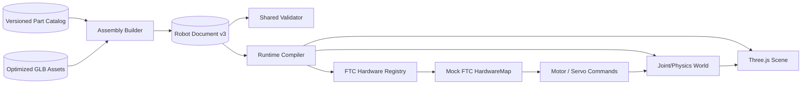
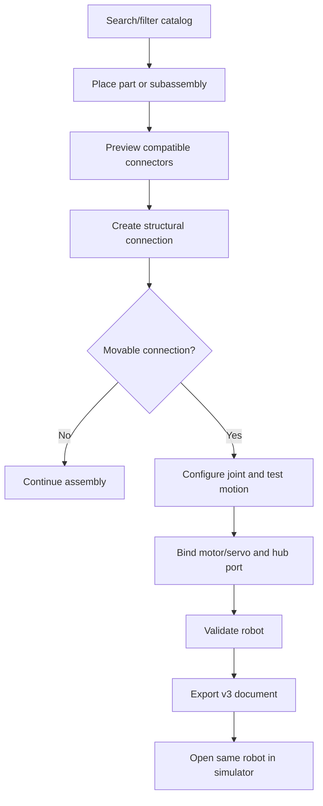
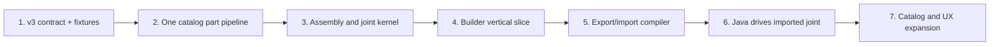

# FTC builder rebuild plan

## Implementation status

> [!success] Foundation and first catalog slice implemented — 2026-09-05
> Work package 1 is implemented under `lib/robot`: v3 domain and catalog types, strict structural
> and semantic validation, quaternion/axis normalization, JSON parsing/serialization, an explicit
> legacy import boundary, a golden FTC arm/claw fixture, and executable contract tests. The catalog
> now also has strict validation, indexed lookup/search, connector compatibility checks, and a
> repeatable asset/manifest build.

Current boundary: these modules are not yet connected to the builder or simulator UI. Version 2 is
recognized as requiring migration, but the migration itself intentionally waits for the legacy-part
policy. The first real entry is the REV Control Hub (`REV-31-1595`), represented by an original,
dimensionally scaled low-poly GLB rather than redistributed vendor CAD. Its generated manifest
records provenance, bounds, collider, mounting connector, device ports, byte/triangle budgets, and
asset hash. Run `npm run parts:build` to regenerate and verify it. See [[11 - Parts Catalog
Pipeline]].

The catalog slice established the input for the next completed milestone: the assembly
transform/snapping kernel. Catalog breadth can now continue against proven connector semantics.

> [!success] Assembly kernel implemented — 2026-09-05
> The pure `lib/robot/assembly` layer now provides quaternion/rigid-transform math, stable rigid-group
> traversal, connector rotation quantization, whole-subassembly snapping, connect/disconnect/move
> commands, structurally shared undo/redo history, and catalog-aware import validation. Mechanical
> joints deliberately remain rigid-group boundaries. See [[12 - Assembly and Snapping Kernel]].

The next critical-path task is the joint/transmission evaluator with a common kinematic result for
builder preview and simulator import. It must cover fixed, revolute, continuous, and prismatic
joints, limits, initial positions, axes, and actuator transmission mapping before UI replacement.

## Outcome

Replace the primitive scene editor with an FTC assembly builder where a user can select real parts,
connect them at valid mounting locations, configure every moving joint, assign FTC hardware names
and hub ports, export one versioned robot document, and import that document into the simulator with
the same geometry and motion.

> [!important] Shortest path to value
> Build one complete vertical slice before building a large parts catalog: place a real motor and
> mechanism, configure its joint and hardware name, export it, import it into the simulator, and
> move it from student Java. Once that works, expanding the catalog is mostly data and assets rather
> than repeated architecture work.

## Definition of “actual FTC robot”

For this project, an actual FTC robot model must have all of the following:

- vendor/SKU-backed parts with recognizable, dimensionally correct geometry;
- structural connections at declared holes, patterns, shafts, splines, bearings, or faces;
- fixed and movable assemblies whose local frames are explicit;
- real units: meters internally, millimeters in builder inputs, radians internally, degrees in UI;
- mass, center of mass, and simplified collision data where known or intentionally approximated;
- motors, servos, sensors, Control/Expansion Hubs, ports, and case-sensitive device names;
- drivetrain and motion-transmission configuration;
- an export that is sufficient to reconstruct the robot and hardware map in the simulator.

“Real” does not mean rendering every thread or simulating electrical current in the first release.
Fasteners may be instanced or represented as connections, and collision shapes should be simplified.
Competition legality must be a versioned advisory check tied to the current season, never an
unqualified permanent claim: FIRST publishes and updates season materials independently.

## Non-goals for the first release

- Full CAD editing, machining, or parametric part design
- Automatic generation of a buildable bill of materials from arbitrary custom geometry
- Wire routing and electrical/thermal simulation
- Exact flex, backlash, belt/chain dynamics, tire deformation, or motor current curves
- Every vendor part before the end-to-end workflow is proven
- A claim that passing validation guarantees inspection or competition legality

## Architecture to build

Separate four concepts that are currently conflated: catalog parts, assembly instances, mechanical
joints, and FTC hardware configuration.



### One shared package boundary

Create framework-independent modules so the builder and simulator cannot drift:

```text
lib/robot/
  schema/                 v3 types, validation, migrations, serialization
  catalog/                catalog types, loader, search index
  assembly/               connectors, snapping, transforms, commands
  kinematics/             frames, joints, transmissions, limits
  runtime/                document compiler and hardware registry
  validation/             mechanical, hardware, and export diagnostics
components/robot-builder/
  viewport/               Three.js rendering and picking only
  panels/                 catalog, tree, inspector, hardware, validation
  state/                  command reducer, history, selection, tools
scripts/parts/            repeatable CAD-to-GLB catalog pipeline
public/robot-parts/        optimized assets and generated manifests
```

The shared modules must not import React or Three.js unless a type is isolated behind an adapter.
This makes schema, snapping, kinematics, import, and hardware behavior testable without WebGL.

## Robot document v3

Do not extend the existing `RobotPart` object until it contains every concern. Introduce a v3
document with stable IDs and separate collections. Keep catalog data outside each saved robot so
exports stay small.

```ts
interface RobotDocumentV3 {
  schemaVersion: 3;
  id: string;
  name: string;
  units: "m";
  catalogVersion: string;
  instances: PartInstance[];
  connections: StructuralConnection[];
  joints: MechanicalJoint[];
  transmissions: MotionTransmission[];
  hardware: HardwareConfiguration;
  drivetrain?: DrivetrainConfiguration;
  customAssets?: AssetManifestEntry[];
  metadata: { createdAt: string; updatedAt: string };
}
```

### Part instances

Each instance references `catalogPartId` and stores only identity, authored transform, appearance
overrides, and optional custom-asset reference. It must not duplicate vendor specs or mesh data.

### Structural connections

A connection links a connector on instance A to a compatible connector on instance B. Store both
connector IDs, rotation/index around the connector, offset, and fastener choice. This retains design
intent: editing a mount location later can recompute the assembly instead of merely copying a
transform as the current builder does.

Connector types should initially cover:

- planar mounting faces and hole-pattern points;
- round, hex, D, and vendor-specific shafts/bores;
- servo splines/horns;
- bearing seats;
- linear rail/carriage attachment points;
- free/custom anchors for parts without catalog metadata.

Compatibility is data-driven (`accepts` tags plus dimensions/tolerance), not hard-coded in React.

### Mechanical joints

Joints connect two **rigid assemblies**, not necessarily two catalog parts. Fixed structural
connections are collapsed into rigid-body groups during runtime compilation; this avoids simulating
hundreds of brackets and fasteners as separate bodies.

```ts
type JointKind = "fixed" | "revolute" | "continuous" | "prismatic";

interface MechanicalJoint {
  id: string;
  name: string;
  kind: JointKind;
  parentInstanceId: string;
  childInstanceId: string;
  parentFrame: Transform;
  childFrame: Transform;
  axis: Vec3;
  limits?: { lower: number; upper: number };
  dynamics: { damping: number; friction: number };
  initialPosition: number;
  collisionBetweenBodies: boolean;
}
```

- `fixed`: no degrees of freedom.
- `revolute`: bounded rotation for arms, turrets, and servos.
- `continuous`: unbounded rotation for wheels, flywheels, and intakes.
- `prismatic`: bounded translation for slides and linear actuators.

The inspector must expose both local frames, axis, limits, initial position, damping/friction, and a
live test control. Render parent/child anchors and axes in the viewport. Invalid zero axes, reversed
limits, disconnected bodies, and impossible references block export.

### Transmissions

Keep the actuator separate from the joint. A motor may drive a joint directly or through gears,
chain, belt, leadscrew, or cascade. The first version needs a generic mapping:

```ts
interface MotionTransmission {
  id: string;
  actuatorDeviceId: string;
  jointId: string;
  ratio: number;          // actuator rotations / joint unit
  direction: 1 | -1;
  efficiency: number;
  encoderTicksPerActuatorRevolution?: number;
}
```

This one abstraction handles gear reduction, reversed mechanisms, encoder conversion, and common
slides without embedding motor logic in a mesh or joint. Compound/mimic joints can come later.

### Hardware configuration

Mirror the FTC mental model: controller modules have typed ports; a device has one unique,
case-sensitive configured name and occupies compatible ports. FTC documentation states that motors,
servos, and sensors must be configured before code can access them and the `hardwareMap` name must
match that configuration exactly.

```ts
interface HardwareConfiguration {
  modules: HardwareModule[]; // Control Hub, optional Expansion Hub
  devices: HardwareDevice[]; // motor, servo, sensor, IMU, etc.
}

interface HardwareDevice {
  id: string;
  name: string;
  type: "dcMotor" | "servo" | "crServo" | "imu" | "distance" | "touch" | "color";
  partInstanceId: string;
  moduleId: string;
  port: string;
  direction?: "forward" | "reverse";
}
```

The shared validator must reject duplicate names, duplicate port assignments, incompatible port
types, missing joint bindings, unknown catalog references, and Java requests for unconfigured
devices. Unknown hardware must raise a useful runtime error instead of being silently ignored.

## Real-parts catalog

### Catalog record

Each catalog entry should contain:

- stable internal ID, vendor, SKU, product name, category, and lifecycle status;
- source page, source asset URL, source version/date, license/permission, and attribution;
- dimensions, mass, center of mass if known, and physical/spec provenance;
- visual GLB path, thumbnail, bounds, default orientation, and level of detail;
- simplified collider definitions;
- connectors with type, local frame, compatible dimensions/tags, and optional hole pattern;
- device capabilities for motors, servos, sensors, and hubs;
- search keywords and compatible build systems.

### Asset pipeline

Use vendor-provided STEP/CAD as an **offline source**, not a file loaded by the browser. Vendor
product pages commonly provide STEP plus specs—for example, REV's Control Hub page exposes CAD and
port counts, while goBILDA motor and servo pages expose STEP downloads and performance data. Every
asset still needs license/redistribution approval before it is committed or served.

Pipeline:

1. Record source, license decision, checksum, real dimensions, and SKU in a catalog source file.
2. Convert STEP to a consistently oriented mesh offline.
3. Remove invisible internals, tiny fastener/thread geometry, duplicate materials, and excess
   vertices.
4. Produce a dimensionally correct GLB plus thumbnail and one simplified collider set.
5. Add connectors manually or through a small metadata authoring tool.
6. Validate scale, bounds, connector frames, triangle/byte budgets, missing attribution, and asset
   hashes in CI.
7. Generate the runtime catalog manifest; do not hand-edit generated output.

Use GLB/glTF for delivery because it is designed for compact runtime scene transmission and Three.js
loads it directly. Add mesh compression only after measuring; repeated brackets, wheels, and
fasteners should share cached geometry/materials or use instancing.

### Minimum useful catalog

Start with approximately 15–25 carefully completed entries, not hundreds of incomplete ones:

- Control Hub and Expansion Hub;
- two representative legal gearmotors with encoder specs;
- one standard positional servo and one continuous-rotation servo;
- mecanum and traction wheels;
- one coherent structural system: channels/extrusions, plates, brackets, shafts, hubs, bearings,
  spacers, and common fasteners;
- one linear-slide kit;
- distance, touch, color, and IMU representations;
- battery and power switch as required visual/configuration parts.

Pick one structural ecosystem for the first reference robot. Add REV, goBILDA, AndyMark, and custom
parts through the same vendor-neutral schema after the pipeline and connector semantics are proven.
Represent stocked lengths and gear ratios as catalog variants with distinct SKUs while sharing
geometry and material data where possible.

## Builder experience



Required UI regions:

- searchable, virtualized parts catalog with category/vendor/system filters;
- central 3D assembly viewport with snapping, selection, multi-select, local/world gizmos, focus,
  isolate, and exploded-view support later;
- assembly tree that distinguishes rigid groups, parts, joints, and hardware;
- context-sensitive inspector for transforms, connections, joints, transmissions, and ports;
- validation panel with click-to-focus errors and warnings;
- persistent undo/redo, keyboard shortcuts, duplicate, delete, and autosave recovery;
- explicit Export and “Open in Simulator” actions.

Do not put domain mutations directly in panel components. Represent every edit as a command with
`do`/`undo`, keep selection/tool state transient, and derive the scene from the document. This makes
undo/redo, autosave, collaboration, and tests cheaper.

## Simulator import and joint execution

Implement one `compileRobotDocument(document, catalog)` path used by preview and simulator:

1. Validate and migrate the document.
2. Resolve catalog assets and connector transforms.
3. Collapse fixed-connected instances into rigid assemblies.
4. Calculate visual hierarchy, aggregate mass/center of mass, and compound colliders.
5. Create movable joints between rigid assemblies.
6. Create the hardware registry from modules/devices/ports.
7. Attach transmissions between configured devices and joints.
8. Build the Three.js scene and return stable handles for synchronization.

Use the same kinematic/joint evaluator in the builder test control and simulator. For initial
delivery, deterministic kinematics can drive mechanisms while the drivetrain retains the existing
planar model. Add a physics adapter behind the same interface once the vertical slice passes. Rapier
is a strong candidate because its official JavaScript API supports fixed, revolute, and prismatic
joints; prototype it before committing because continuous motor behavior, compound colliders, and
performance still need project-specific validation.

The simulator import must replace the hard-coded chassis/arm/claw scene and fixed device table. Java
`hardwareMap.get(type, name)` must resolve the imported configuration, validate the requested type,
and bind commands to the imported robot's transmission/joint.

Every joint saved by the builder must use a runtime-supported type and be testable in the builder;
there must be no display-only joint configuration. The initial four types cover the reference robot
and common FTC drivetrains/mechanisms. Add compound, mimic, spherical, or generic constraints only
as end-to-end schema + builder + runtime capabilities, never as inert metadata.

## Efficient execution plan

### Critical path

Only this sequence is serial:



Anything not proving the next arrow waits. In particular, do not build a huge catalog, polish every
panel, or add full-field physics before Java can move one exported mechanism.

### Work packages and gates

| # | Work package | Size | Depends on | Gate / proof |
|---|---|---:|---|---|
| 0 | Freeze requirements and choose reference robot | S | — | One agreed chassis + arm/slide + claw, documented expected motion |
| 1 | v3 schema, validator, migrations, golden fixtures | M | 0 | Round-trip and invalid-document tests pass without React |
| 2 | Asset/catalog pipeline and first 5–8 parts | M | 1 types | Reproducible GLBs, metadata, connectors, provenance, CI validation |
| 3 | Assembly kernel, connector snapping, command history | L | 1 | Headless transform/snap/undo tests pass |
| 4 | Joint/transmission evaluator | L | 1, 3 | Fixed/revolute/continuous/prismatic tests pass at limits and ratios |
| 5 | Thin builder UI vertical slice | L | 2–4 | Build reference mechanism, test motion, export without JSON editing |
| 6 | Runtime document compiler and scene adapter | L | 2, 4 | Export opens with identical transforms and joints in simulator |
| 7 | Dynamic hardware registry and Java bridge | M | 1, 4, 6 | Imported named motor/servo moves correct joint; bad names fail clearly |
| 8 | Complete reference robot and MVP catalog | L | 2, 5–7 | Four drive motors + mechanism + servo run from TeleOp and Autonomous |
| 9 | Persistence, validation UX, performance, cutover | M | 8 | Recovery/export/import/performance/browser acceptance checks pass |

Sizes are relative and deliberately exclude calendar estimates until the team and asset-licensing
availability are known.

### Parallel work after schema freeze

With multiple contributors, these tracks can proceed concurrently:

- **Catalog track:** licensing, CAD conversion, metadata, thumbnails, connectors.
- **Domain track:** assembly commands, snapping, joints, transmissions, migrations, validators.
- **Runtime track:** document compiler, device registry, Three.js/physics adapters, Java errors.
- **UX track:** catalog/tree/inspector panels using fixtures and mocked domain commands.
- **Quality track:** golden robots, headless tests, browser flows, asset/performance budgets.

Integrate each track against the same versioned fixtures. Avoid parallel invention of schemas.

### Pull-request sequence

Keep changes reviewable and deployable:

1. Add v3 types, JSON schema/validator, migration interface, and golden robot fixtures.
2. Add catalog schema, one hand-authored test part, asset loader, and cache.
3. Add connector math, snapping, assembly commands, and undo/redo tests.
4. Add joint/transmission evaluator and visual debug helpers.
5. Add a minimal builder behind a temporary internal route or feature switch.
6. Add export/import and compile the fixture into the existing simulator scene.
7. Replace fixed runtime devices with the imported hardware registry.
8. Make Java move the imported joint; add an end-to-end browser test.
9. Add the reference robot catalog set and finish the main builder panels.
10. Switch `/simulator-builder` to v3, retain v2 import migration, then remove obsolete primitive UI
    and the disconnected `TeacherLessonDraft` scaffold.

## Tests that block release

### Schema and migration

- v3 serialize/parse round trip is stable.
- v2 primitive documents either migrate deterministically or return a precise unsupported warning.
- Unknown schema/catalog versions fail safely.
- Dangling IDs, cycles, duplicate hardware names/ports, and invalid values are rejected.

### Assembly

- Connector alignment produces expected world transforms for rotated/nested assemblies.
- Compatibility rules accept valid shaft/bore and mounting pairs and reject invalid pairs.
- Move, connect, disconnect, joint edit, delete, duplicate, undo, and redo are deterministic.

### Joints and transmissions

- Every supported joint works around arbitrary local frames/axes.
- Revolute/prismatic limits clamp correctly; continuous joints wrap without discontinuity.
- Initial position, direction, ratio, encoder conversion, pause/reset, and timestep behavior match in
  builder preview and simulator.
- Fixed groups compile into the expected number of runtime bodies.

### Import/runtime

- Exported reference robot reopens with matching instance, connection, joint, and hardware IDs.
- The runtime scene matches builder transforms within a declared tolerance.
- Each configured motor/servo controls only its bound joint.
- Missing names, wrong types, port conflicts, and unavailable catalog assets produce actionable UI
  errors.
- Existing TeleOp and Autonomous templates work after their device names are mapped to the fixture.

### Performance

Set budgets using the reference robot and a deliberately heavy fixture. Initial targets:

- interactive editing at 60 FPS on the agreed baseline laptop, with 30 FPS as the minimum under the
  heavy fixture;
- no per-frame React state updates for mesh transforms;
- each GLB loaded once and cloned/instanced from cache;
- no physics body per bolt/fastener;
- export JSON contains references, not duplicated meshes;
- load, asset-byte, triangle, draw-call, and memory budgets recorded in CI or browser tests.

Measure before choosing compression or deeper optimization.

## Acceptance scenario

The rebuild is ready to replace the current builder when this can be demonstrated without editing
JSON:

1. Create a robot from a real-parts catalog with a four-motor drivetrain, Control Hub, arm or linear
   slide, and servo claw.
2. Snap the structure using declared connectors.
3. Configure continuous wheel joints, a bounded revolute/prismatic mechanism joint, and a bounded
   servo joint.
4. Assign unique FTC device names and compatible hub ports.
5. Preview every joint through its complete range and receive no blocking validation errors.
6. Export the robot document and import/open it in the simulator.
7. See the same part geometry, assembly transforms, starting pose, and hardware configuration.
8. Compile student Java that retrieves the configured names from `hardwareMap`.
9. Drive, move the mechanism, operate the claw, read encoders/sensors, stop, and reset predictably.
10. Re-import the export and obtain an equivalent document and behavior.

## Risks and controls

| Risk | Control |
|---|---|
| Catalog work consumes the project | Prove one system/reference robot; make additions data-only |
| Vendor CAD cannot be redistributed | Track license per asset; request permission; allow local custom assets; use approved simplified geometry when needed |
| CAD models are too heavy for browsers | Offline simplification, LOD, shared resources, instancing, asset budgets |
| Builder and simulator drift again | One schema, validator, compiler, joint evaluator, and golden fixture package |
| Physics rewrite blocks delivery | Ship deterministic joint/planar behavior first behind an adapter; add measured physics incrementally |
| Fastener-level physics is too expensive | Collapse fixed connections into compound rigid assemblies |
| Hardware behavior remains hard-coded | Generate device registry from exported hardware configuration |
| Old documents break | Versioned migration registry and fixture tests before route cutover |
| “FTC legal” data becomes stale | Season/version metadata and links; advisory language; no permanent legality flag |
| Large rewrite becomes unreviewable | Vertical slice and small PR sequence; old route remains usable until acceptance scenario passes |

## Decisions required before implementation

- [ ] Select the first structural ecosystem and exact reference robot.
- [ ] Confirm permission/licensing policy for vendor CAD derivatives and thumbnails.
- [x] Use meters/radians internally and millimeters/degrees in builder UI.
- [x] Use v3 as a normalized document with external catalog references.
- [ ] Decide whether v2 primitive robots receive a best-effort migration or remain legacy-only.
- [x] Use the initial four joint types and generic transmission model.
- [ ] Choose the baseline browser/device and asset/performance budgets.
- [ ] Spike Rapier against the reference mechanism and decide whether MVP runtime is kinematic,
  physics-backed, or hybrid.
- [ ] Decide how “Open in Simulator” transfers documents initially: URL/session storage, downloaded
  file, or shared persistence. File import/export is the simplest durable baseline.

## Authoritative references

- [FIRST hardware and software configuration](https://ftc-docs.firstinspires.org/en/latest/hardware_and_software_configuration/index.html)
  explains hub-connected motors, servos, and sensors.
- [FIRST hardware configuration guide](https://ftc-docs.firstinspires.org/en/latest/hardware_and_software_configuration/configuring/getting_started/getting-started.html)
  establishes that configured devices and ports precede software access.
- [FIRST Java OpMode guide](https://ftc-docs.firstinspires.org/en/latest/programming_resources/tutorial_specific/android_studio/creating_op_modes/Creating-and-Running-an-Op-Mode-%28Android-Studio%29.html)
  documents case-sensitive `hardwareMap` name matching.
- [Current FTC game and season materials](https://ftc-resources.firstinspires.org/ftc/game) are the
  source for season-specific construction rules and should be linked by any legality checker.
- [REV Control Hub product data](https://www.revrobotics.com/rev-31-1595/) provides authoritative
  port/spec and CAD references for that catalog entry.
- [goBILDA 5203 motor product data](https://www.gobilda.com/5203-series-yellow-jacket-planetary-gear-motor-13-7-1-ratio-24mm-length-8mm-rex-shaft-435-rpm-3-3-5v-encoder/)
  is an example of vendor STEP, encoder, mass, and performance metadata.
- [goBILDA Proton servo product data](https://www.gobilda.com/proton-servo-steel-gears-180-rotation-speed-ratio/)
  is an example of vendor STEP, motion range, speed, and mass metadata.
- [Khronos glTF](https://www.khronos.org/gltf/) defines the runtime-oriented 3D delivery format used
  for optimized browser assets.
- [Rapier JavaScript joints](https://rapier.rs/docs/user_guides/javascript/joints/) documents the
  fixed, revolute, and prismatic primitives proposed for the physics adapter spike.

## Related notes

- [[03 - Robot Builder]]
- [[04 - Simulator Runtime]]
- [[06 - RobotDefinition Schema]]
- [[08 - Roadmap]]
- [[09 - Current Constraints and Decisions]]
