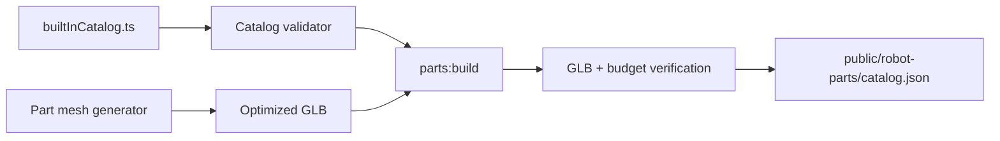

# Parts catalog pipeline

The v3 catalog is the shared source of part identity, geometry, physical approximations,
connectors, and FTC device capabilities. Builder documents reference stable catalog IDs; they do
not embed copies of catalog records or meshes. This keeps exports small and lets the builder and
simulator resolve the same part definition.

## Implemented slice

The first production entry is `rev:REV-31-1595`, the REV Control Hub. Its model is an original
simplified representation generated from published outer dimensions. It is not a copy or conversion
of vendor CAD. The source record carries attribution and explicitly describes that distinction.



The generated manifest records the asset byte size, triangle count, and SHA-256 hash. Stable
metadata uses a fixed catalog generation timestamp so identical inputs produce an identical
manifest.

## Commands and files

Run the complete pipeline from the repository root:

```bash
npm run parts:build
npm test
```

- `lib/robot/catalog/builtInCatalog.ts` contains reviewed source records.
- `lib/robot/catalog/validation.ts` rejects malformed or unsafe catalog data.
- `lib/robot/catalog/catalogIndex.ts` provides lookup, search, and connector matching.
- `scripts/parts/` contains offline asset generation and catalog build scripts.
- `public/robot-parts/` is generated runtime output and should not be hand-edited.

## Acceptance gates

A distributed GLB requires an `approved` license status. Every entry also needs a stable ID,
vendor/SKU identity, source URL and retrieval date, real positive bounds, at least one collider, and
valid connector/device metadata. The build rejects malformed GLBs, mismatched embedded lengths,
assets over 500 KB, and assets over 10,000 triangles.

Unknown mass is permitted temporarily but produces a warning. Before physics fidelity is claimed,
replace missing mass and center-of-mass values with sourced or clearly marked measured values.

## Adding a part

1. Confirm the product identity, dimensions, lifecycle, and device specifications from an
   authoritative source.
2. Decide whether an asset can be redistributed. Record the decision and attribution explicitly.
3. Prefer an original simplified model when CAD redistribution rights are unclear.
4. Add realistic bounds, simplified colliders, and named connector frames in meters.
5. Add FTC device capabilities and ports where applicable.
6. Extend or add the offline generator/converter, then run `npm run parts:build`.
7. Add tests for lookup, validation, and at least one intended connector pairing.
8. Visually inspect scale, orientation, mounting frames, and recognizable appearance before merge.

## Next work

The assembly transform/snapping kernel is now implemented in [[12 - Assembly and Snapping Kernel]].
Next, add the first motor, wheel, structural channel, shaft/hub, and servo entries needed for the
end-to-end reference mechanism while the joint/transmission evaluator is developed against the same
connector and document contracts.
