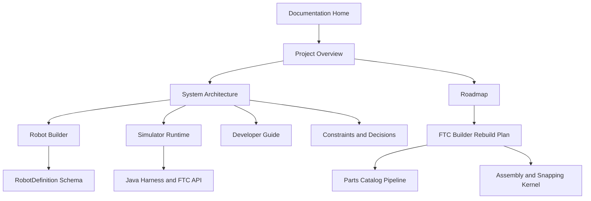

# Code-A-Robot Simulator documentation

This directory is both the project's documentation set and an Obsidian-compatible vault. Open the
`documentation` directory as an Obsidian vault to use wikilinks, backlinks, tags, callouts, and the
Mermaid architecture diagrams.

> [!abstract] Project in one sentence
> Code-A-Robot Simulator is a browser workspace for building lesson robots, writing FTC-style Java,
> controlling a simulated robot, and presenting the experience through an FTC-inspired driver
> station interface.

## Start here
- [[01 - Project Overview]] — purpose, audiences, capabilities, and scope
- [[02 - System Architecture]] — system boundaries, component map, and data flow
- [[03 - Robot Builder]] — primitive assembly workflow, hierarchy, joints, and preview behavior
- [[04 - Simulator Runtime]] — state model, bridge, rendering, gamepad, and telemetry
- [[05 - Java Harness and FTC API]] — browser Java compilation and the supported FTC API subset
- [[06 - RobotDefinition Schema]] — canonical builder data contract and import normalization
- [[07 - Developer Guide]] — setup, routes, repository map, and contribution guidance
- [[08 - Roadmap]] — proposed path from prototype to Code-A-Robot integration
- [[09 - Current Constraints and Decisions]] — limitations, risks, and architectural decisions
- [[10 - FTC Builder Rebuild Plan]] — efficient plan for real parts, working joints, and runtime import
- [[11 - Parts Catalog Pipeline]] — source policy, generated assets, validation, and contribution flow
- [[12 - Assembly and Snapping Kernel]] — connector frames, rigid groups, edit commands, and history
- [[Glossary]] — project and FTC terminology

## Documentation map

## Status vocabulary

The documentation uses these terms deliberately:

- **Implemented** means the behavior exists in the current repository.
- **Prototype** means it works as a proof of concept but is not yet production-ready.
- **Scaffolded** means types or data exist without an active end-to-end user flow.
- **Proposed** means a future direction inferred from the product intent and extension comments; it
  is not a committed release promise.

> [!info] Source of truth
> The TypeScript implementation remains authoritative. Update the relevant note when behavior,
> routes, schemas, or runtime APIs change.
